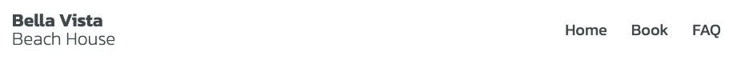
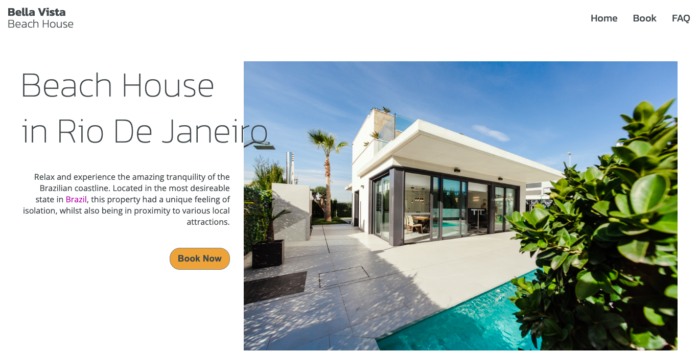
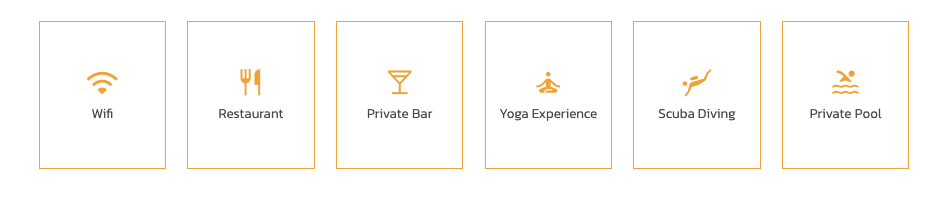
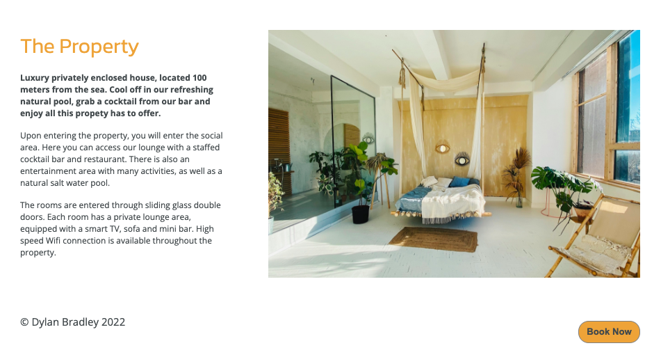
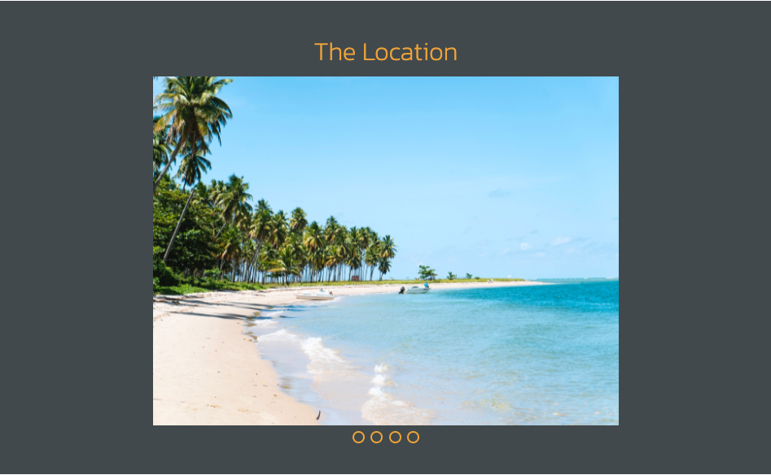
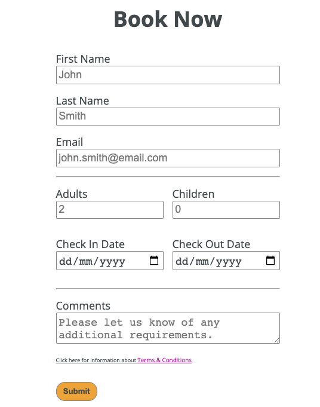
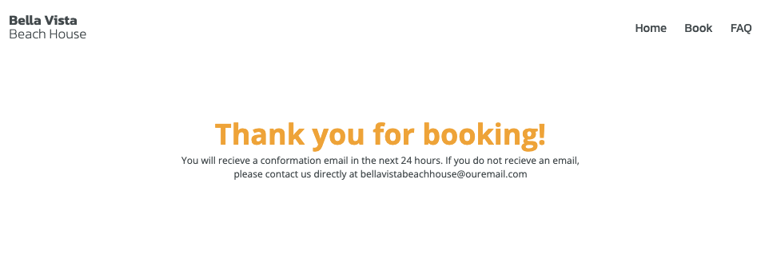
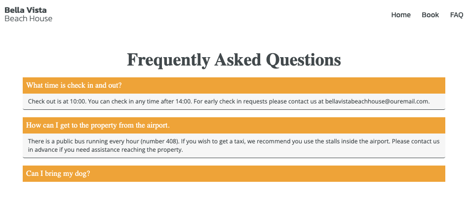

# Bell Vista Beach House

This project is a rental property portfolio website, built with HTML and CSS. This website focuses on displaying the property to achieve maximum visual appeal. It gives used the ability to browse image galeries, book nights in the property, and read frequently asked questions. 

## Features

### *Navigation Bar*

The navigation bar includes a logo which links to the homepage. It also includes a fully responsive menu, linking to the Home, Booking and FAQ pages. 

### *Homepage: Intro*

The homepage intro section gives the reader a brief description of the property, and an image of the exterior. 

Ths section includes an external link to additional resources about the country.

### *Homepage: Services Icons*

The services section includes icons indicating the services available at the property.

### *Homepage: The Property*

The property section includes a longer description of the property. Along with an automatic slider galery showing the inderior areas.

### *Homepage: The Location*

The location section includes a description of the location, along with a manual slider galery showing the surrounding areas.

The slider is controlled by clicking the buttons below the image to select a new image. 

### *Booking Page*

Includes a form allowing the user to emter personal details, including

1. First & Last names
2. Email address
3. Number of adults & children
4. Checkin & checkout dates
5. Additional comments (Optional)

The form includes a submit button which takes the user to the "confirmation" page, if the booking was successful.

There is also an external link, bringing the user to an information page regarding Terms & Conditions.

### *Confirmation Page*

This page displays a message indication the user has successfully submitted their booking form, with information in case they do not recieve an email.

### *FAQ Page*

This includes a collapsible list of frequently asked questions. 

## Validator Testing

The HTML and css were passed through the following validators:

https://validator.w3.org/nu/?doc=https%3A%2F%2Fcode-institute-org.github.io%2Flove-running-2.0%2Findex.html

https://jigsaw.w3.org/css-validator/validator?uri=https%3A%2F%2Fvalidator.w3.org%2Fnu%2F%3Fdoc%3Dhttps%253A%252F%252Fcode-institute-org.github.io%252Flove-running-2.0%252Findex.html&profile=css3svg&usermedium=all&warning=1&vextwarning=&lang=en#css

NOTE: CSS validator flagged CSS variables as issues. 

# Deployment

This website is hosted in GitHub pages.

Steps:
- In repository, go to *settings*
- Under *code and automation* sidebar, select *pages*
- Under source select *deploy from branch*
- Under branch selest *main*
- save

The site can be found at: https://dylbrad.github.io/Beach-House-Rental-Website/ 
